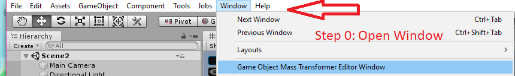
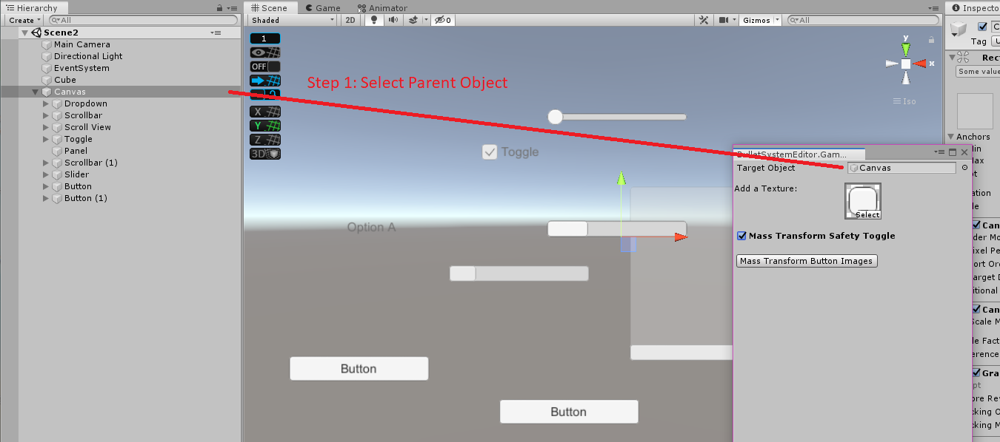
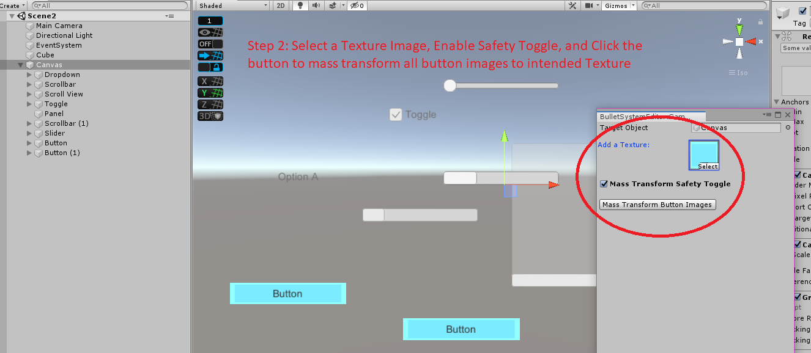
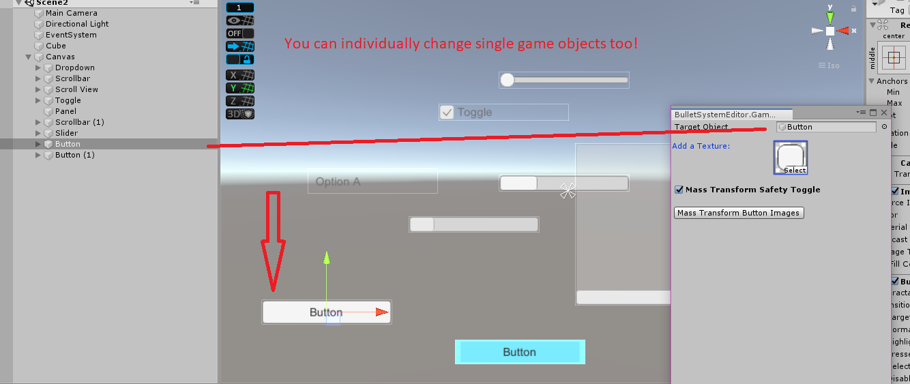
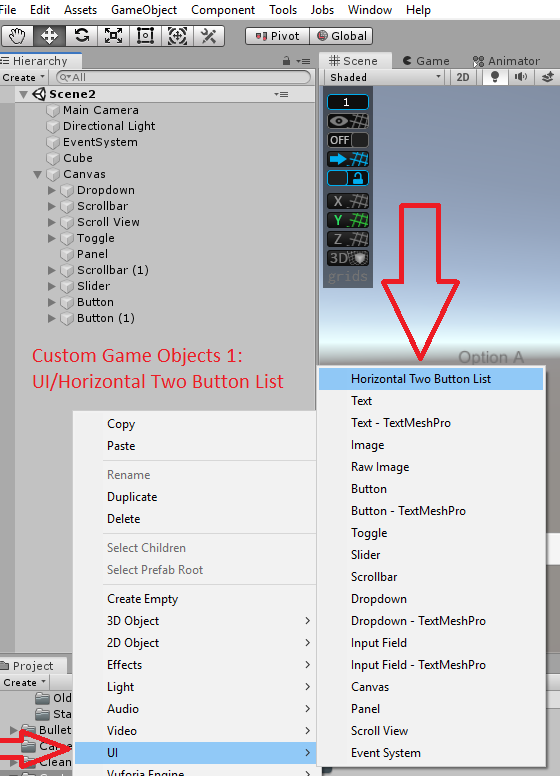
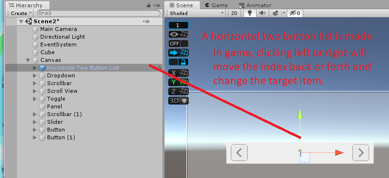
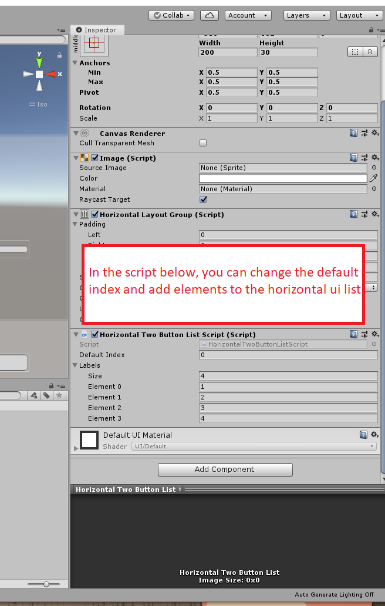

# Custom Unity Editor Scripts

Custom Editor Scripts For Unity C#.

Credit: Kevin Wu

These are scripts I have made in Unity for the purpose of improving QoL.

To use, simply download the repo or zip, unzip and drag the editor folder to the intended Unity project's own folder

//-------------------------------------------------------------------------------------------------------------------

## 1. Mass Game Object Transformer
  - Ver 0.1
  
  -Functions-
  - Convert Button Images to new Images
  
  
  
  
  
  
  
  
  
//-------------------------------------------------------------------------------------------------------------------

## 1. Custom Game Objects
  - Ver 0.1
  
  -UI/Horizontal Two Button List
  
  
  
  
  
  
